1.  Завантажте дані

    1.1 Створення схеми

**Рішення**

```sql
CREATE DATABASE pandemic;

USE pandemic;
```

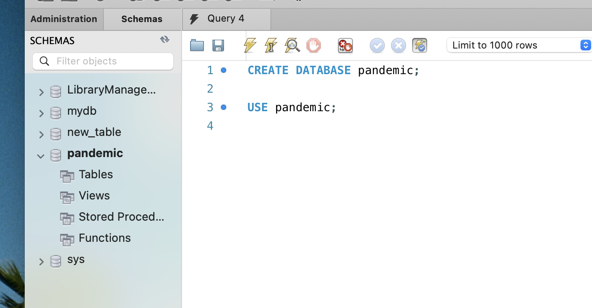

1.2 Іморт данних

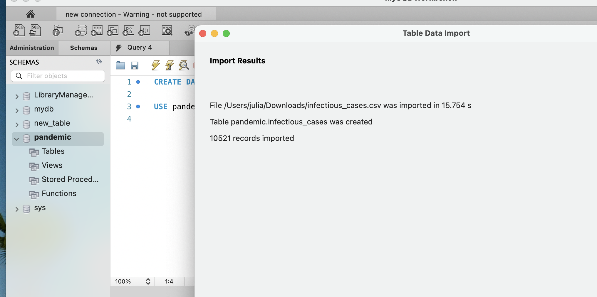

1.3 Заміна даних з пустими значеннями

```sql
UPDATE
 infectious_cases
SET
 polio_cases = NULL
WHERE
 polio_cases = '';
```
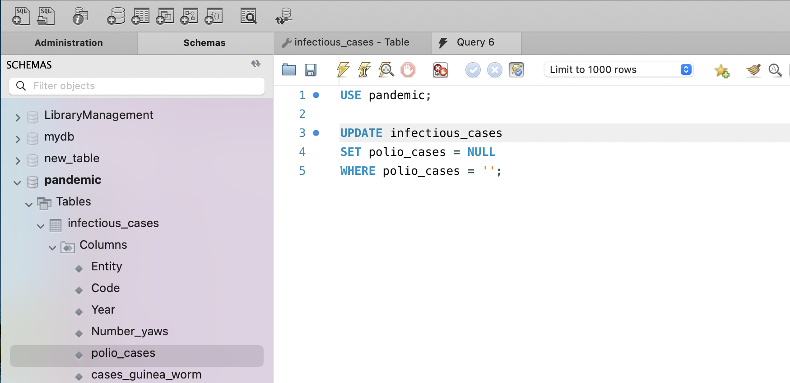

або 

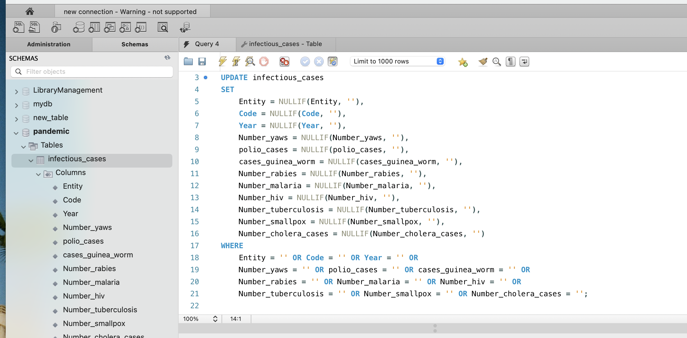

2. Нормалізуйте таблицю infectious_cases до 3ї нормальної форми. Збережіть у цій же схемі дві таблиці з нормалізованими даними.


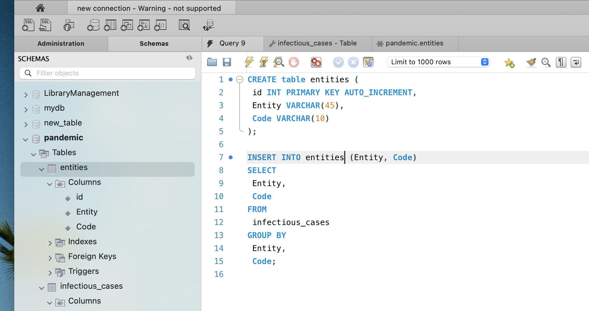

```sql
CREATE table entities (
 id INT PRIMARY KEY AUTO_INCREMENT,
 Entity VARCHAR(45),
 Code VARCHAR(10)
);

INSERT INTO entities (Entity, Code)
SELECT
 Entity,
 Code
FROM
 infectious_cases
GROUP BY
 Entity,
 Code;
```

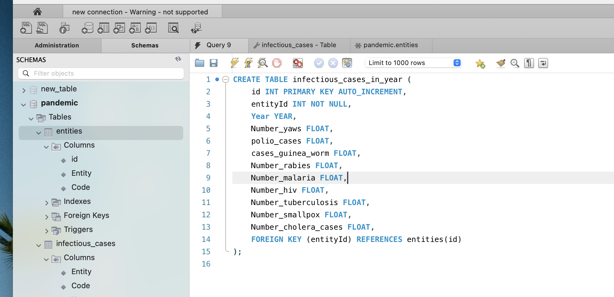

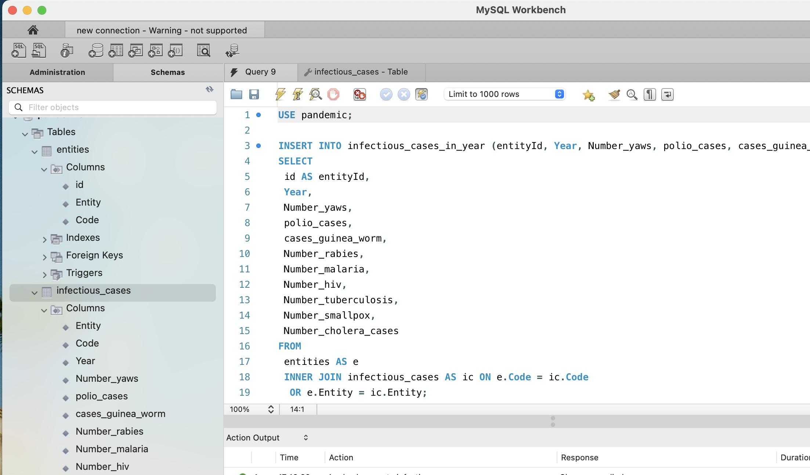

```sql
CREATE TABLE infectious_cases_in_year (
   id INT PRIMARY KEY AUTO_INCREMENT,
   entityId INT NOT NULL,
   Year YEAR,
   Number_yaws FLOAT,
   polio_cases FLOAT,
   cases_guinea_worm FLOAT,
   Number_rabies FLOAT,
   Number_malaria FLOAT,
   Number_hiv FLOAT,
   Number_tuberculosis FLOAT,
   Number_smallpox FLOAT,
   Number_cholera_cases FLOAT,
   FOREIGN KEY (entityId) REFERENCES entities(id)
);


INSERT INTO infectious_cases_in_year (entityId, Year, Number_yaws, polio_cases, cases_guinea_worm, Number_rabies, Number_malaria, Number_hiv, Number_tuberculosis, Number_smallpox, Number_cholera_cases)
SELECT
id AS entityId,
Year,
Number_yaws,
polio_cases,
cases_guinea_worm,
Number_rabies,
Number_malaria,
Number_hiv,
Number_tuberculosis,
Number_smallpox,
Number_cholera_cases
FROM
entities AS e
INNER JOIN infectious_cases AS ic ON e.Code = ic.Code
 OR e.Entity = ic.Entity;

```

3. Проаналізуйте дані

Для кожної унікальної комбінації Entity та Code або їх id порахуйте середнє, мінімальне, максимальне значення та суму для атрибута Number_rabies.
Результат відсортуйте за порахованим середнім значенням у порядку спадання.
Оберіть тільки 10 рядків для виведення на екран.

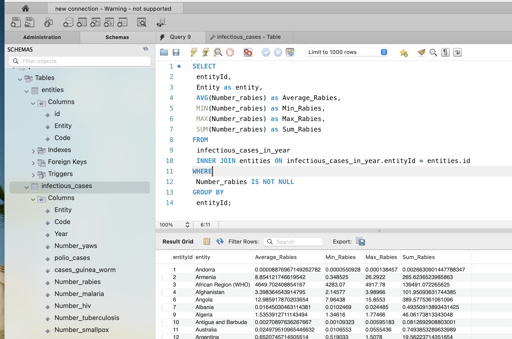

```sql
SELECT
 entityId,
 Entity as entity,
 AVG(Number_rabies) as Average_Rabies,
 MIN(Number_rabies) as Min_Rabies,
 MAX(Number_rabies) as Max_Rabies,
 SUM(Number_rabies) as Sum_Rabies
FROM
 infectious_cases_in_year
 INNER JOIN entities ON infectious_cases_in_year.entityId = entities.id
WHERE
 Number_rabies IS NOT NULL
GROUP BY
 entityId;
```

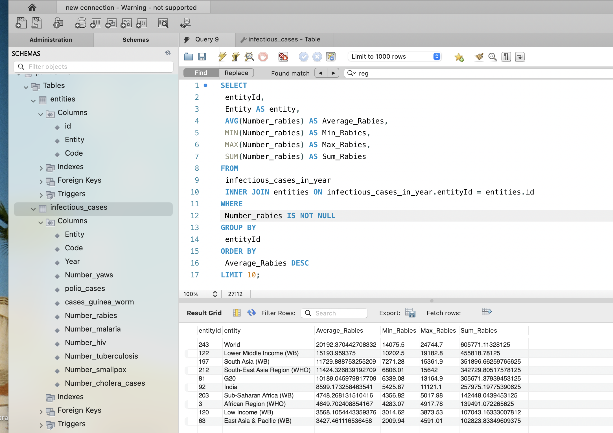

```sql
SELECT
entityId,
Entity AS entity,
AVG(Number_rabies) AS Average_Rabies,
MIN(Number_rabies) AS Min_Rabies,
MAX(Number_rabies) AS Max_Rabies,
SUM(Number_rabies) AS Sum_Rabies
FROM
infectious_cases_in_year
INNER JOIN entities ON infectious_cases_in_year.entityId = entities.id
WHERE
Number_rabies IS NOT NULL
GROUP BY
entityId
ORDER BY
Average_Rabies DESC
LIMIT 10;
```

4. Побудуйте колонку різниці в роках.

Для оригінальної або нормованої таблиці для колонки Year побудуйте з використанням вбудованих SQL-функцій:

атрибут, що створює дату першого січня відповідного року,
атрибут, що дорівнює поточній даті,
атрибут, що дорівнює різниці в роках двох вищезгаданих колонок.

```sql
SELECT
 id,
 entityId,
 Year,
 MAKEDATE(Year, 1) AS first_day_of_year,
 CURRENT_DATE() AS today_date,
 TIMESTAMPDIFF(YEAR, MAKEDATE(Year, 1), CURRENT_DATE()) as years_ago
FROM
 infectious_cases_in_year;
```

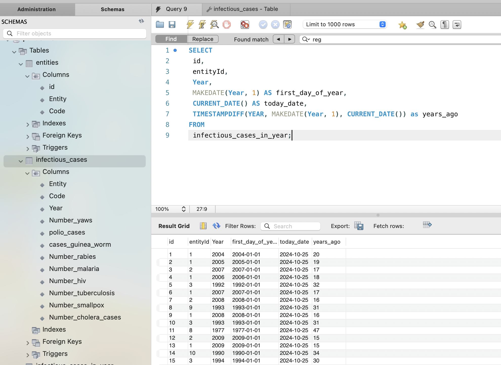

5. Побудуйте власну функцію.

Функція має приймати на вхід значення року, а повертати різницю в роках між поточною датою та датою, створеною з атрибута року (1996 рік → ‘1996-01-01’).

```sql
DROP FUNCTION IF EXISTS get_difference_year;
DELIMITER //
CREATE FUNCTION get_difference_year(year YEAR)
RETURNS INT
DETERMINISTIC
NO SQL
BEGIN
 RETURN TIMESTAMPDIFF(YEAR, MAKEDATE(year, 1), CURRENT_DATE());
END;
//
DELIMITER ;

SELECT
 id,
 entityId,
 Year,
 get_difference_year (Year) AS years_ago
FROM
 infectious_cases_in_year;
```

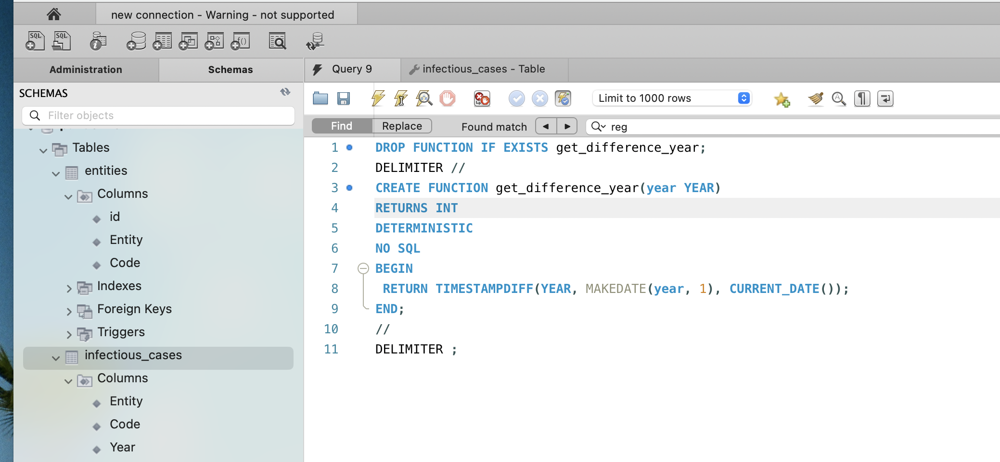